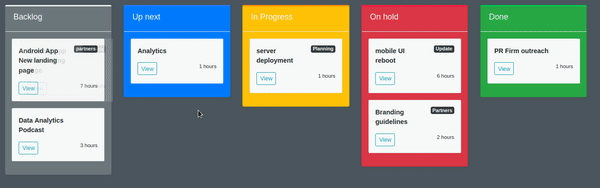

# KanbanManager
Simple trello clone written in Django as part of an internship project at Safran Tunisia.

## First time setup

`pip install -r requirements.txt`

`python manage.py makemigrations`

`python manage.py migrate`

`python manage.py runserver`

## Adding/removing new projects and/or cards 
Projects and cards can be managed with the django admin panel at *localhost/admin* with a newly created admin user or with

User      **admin** and
Password  **adminpassword**
